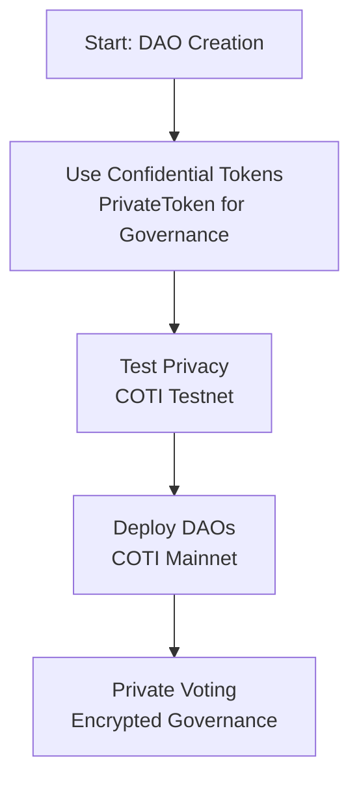

# COTI Integration

[Syncra](https://syncra.xyz/) enables users to create and manage Decentralized Autonomous Organizations (DAOs) with robust privacy protections. By integrating with COTI V2, a privacy-focused Layer 2 blockchain on Ethereum, Syncra ensures that governance for token-based and wallet-based DAOs remains confidential. This documentation outlines how Syncra uses COTI's Confidential ERC20 tokens (PrivateToken) to deliver private voting and secure token management, deployed on COTI Mainnet.

This page is for DAO creators, voters, and community members who want to understand how Syncra's privacy features safeguard their governance activities.

## Privacy Benefits for Users

Syncra's integration with COTI provides the following privacy features for DAOs:

- **Confidential Voting**: Your vote choices and voting power are encrypted, protecting against coercion or exposure.
- **Secure Token Balances**: Governance token holdings (for token-based DAOs) are hidden using COTI's Confidential Tokens.
- **Private Wallet Actions**: For wallet-based DAOs, your signed actions (e.g., votes or proposals) remain confidential.

These features ensure secure and private governance for token-based DAOs (where tokens determine voting influence) and wallet-based DAOs (where wallets directly sign actions).

## Integration Process

Syncra's integration with COTI's privacy technology was completed in phases to deliver reliable, user-ready DAOs. Below is the documented process, focusing on how privacy is implemented for end-users.

### 1. Implementing Confidential Tokens

Syncra uses COTI's PrivateToken system for Confidential ERC20 tokens to power token-based DAOs.

- Token balances and transfers are encrypted, ensuring no one can see your holdings or voting power.
- For wallet-based DAOs, user wallets sign governance actions (e.g., proposing or voting) with privacy protections, keeping identities and actions hidden.

### 2. Testing on COTI Testnet

- Syncra tested privacy features on COTI's Testnet to validate encryption for voting and token management.
- Tests ensured that individual votes and token amounts remained private, with only aggregated results (e.g., proposal outcomes) visible.

### 3. Deploying to COTI Mainnet

- Syncra's token-based and wallet-based DAOs are deployed on COTI Mainnet, the production blockchain.
- Users can participate in governance with confidence, knowing their actions are encrypted.
- Transactions are verifiable on [COTI's explorer](https://explorer.coti.io), but sensitive details (e.g., vote choices or token balances) remain hidden.

## Integration Flowchart

The following diagram illustrates how Syncra integrates COTI's privacy features for DAO governance:

## Key Takeaways for Users

- **Privacy**: Vote and propose without exposing your identity, tokens, or actions.
- **Security**: COTI's encryption protects your data on the blockchain.
- **Ease of Use**: Syncra's interface makes private governance straightforward for all users.
- **Trust**: Mainnet deployment ensures reliable and secure DAOs.

## Additional Resources

- **COTI Documentation**: Learn more about COTI's privacy technology at [COTI Quickstart](https://docs.coti.io).
- **Syncra Details**: Explore our privacy integration at [Syncra Blog](https://syncra.xyz/blog).
- **Support**: Join [COTI's Discord](https://discord.coti.io) or contact Syncra for assistance.
